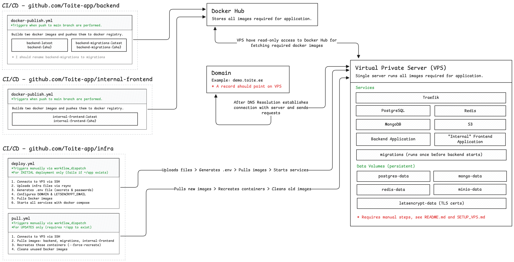
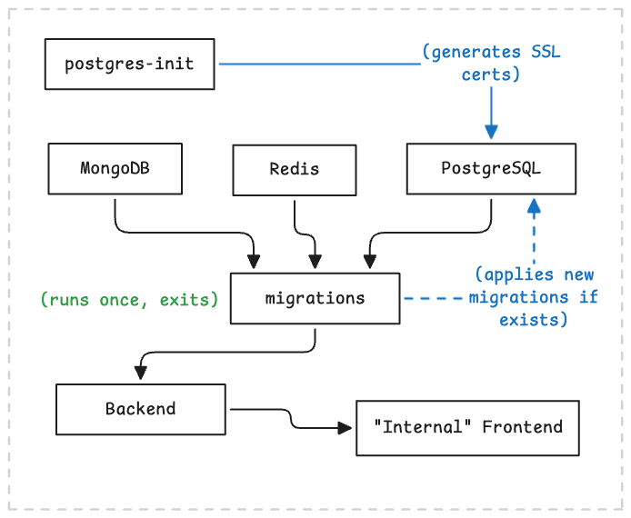

# Toite Infrastructure

This repository contains the infrastructure configuration for deploying Toite applications. It includes Docker Compose setup, deployment scripts, and documentation for running the complete application stack on a VPS.

## Architecture Overview



The infrastructure follows a CI/CD pipeline where:

1. **CI/CD Pipelines** - GitHub Actions in the `backend` and `internal-frontend` repositories build and push Docker images to Docker Hub when changes are merged to main
2. **Docker Hub** - Acts as the central registry storing all application images
3. **Domain** - DNS A record points to the VPS (e.g., `demo.toite.ee`)
4. **VPS** - A single server runs all services via Docker Compose:
   - **Traefik** - Reverse proxy handling routing and TLS certificates
   - **PostgreSQL, Redis, MongoDB** - Data stores
   - **MinIO** - S3-compatible object storage
   - **Backend Application** - API server
   - **Internal Frontend** - Admin/internal web application

### Service Startup Order



Services start in a specific order based on their dependencies:

1. **postgres-init** - Generates SSL certificates for PostgreSQL, then exits
2. **PostgreSQL, MongoDB, Redis** - Data stores start in parallel (PostgreSQL waits for certs)
3. **migrations** - Applies database migrations to PostgreSQL, then exits
4. **Backend** - Starts after all data stores are healthy and migrations complete
5. **Internal Frontend** - Starts after backend is running

## Getting Started

### 1. Set Up Your VPS

Follow the [VPS Setup Guide](SETUP_VPS.md) to provision and secure your server. This guide covers:

- Creating a hardened Ubuntu server with security best practices
- Setting up SSH key-based authentication
- Installing rootless Docker
- Configuring firewall and automatic security updates

### 2. Configure GitHub Environment

Before deploying via CI/CD, you need to configure GitHub environments with the required secrets and variables.

1. Go to your repository **Settings > Environments**
2. Create an environment (e.g., `production`, `dev`, or `demo`)
3. Add the following configuration:

**Secrets** (per environment):

| Secret | Description |
|--------|-------------|
| `VPS_HOST` | VPS IP address or hostname |
| `VPS_PORT` | SSH port number (e.g., `22` or custom) |
| `VPS_SSH_PRIVATE_KEY` | SSH private key for the `deploy` user |
| `LETSENCRYPT_EMAIL` | Email for Let's Encrypt certificate notifications |

**Variables** (per environment):

| Variable | Description |
|----------|-------------|
| `DOMAIN` | Domain name for the deployment (e.g., `demo.toite.ee`) |

### 3. Deploy via GitHub Actions

The deployment is triggered manually via the **Deploy Infrastructure** workflow:

1. Go to **Actions > Deploy Infrastructure**
2. Click **Run workflow**
3. Select the target environment from the dropdown
4. Click **Run workflow** to start deployment

**What the deployment does:**

1. Validates all required secrets and variables are configured
2. Connects to the VPS via SSH as the `deploy` user
3. Checks that `~/app` doesn't already exist (fails if it does)
4. Verifies Docker is installed and running
5. Uploads files via rsync (excludes `.git`, `.github`, `docs`, `.env`)
6. Generates `.env` file with random passwords and secrets
7. Sets `DOMAIN` and `LETSENCRYPT_EMAIL` from GitHub configuration
8. Pulls all Docker images
9. Starts all services with `docker compose up -d`

After successful deployment, you can view the status in the **Deployments** section of the repository.

> **Note:** This workflow is for initial deployment only. If `~/app` already exists on the VPS, you must remove it manually before redeploying.

### 4. Update Running Services

After initial deployment, use the **Pull & Restart Infrastructure** workflow to update application containers with new images:

1. Go to **Actions > Pull & Restart Infrastructure**
2. Click **Run workflow**
3. Select the target environment from the dropdown
4. Click **Run workflow** to start the update

**What the update does:**

1. Connects to the VPS via SSH
2. Pulls latest images for: `backend`, `migrations`, `internal-frontend`
3. Recreates those containers with `--force-recreate`
4. Cleans up unused Docker images

> **Note:** This workflow only updates application services. Infrastructure services (Traefik, PostgreSQL, MongoDB, Redis, MinIO) are not affected. The `.env` file and data volumes are preserved.

### 5. Seed Database (dev/demo only)

Use the **Seed Database** workflow to reset databases and populate them with seed data. This is useful for testing or resetting non-production environments.

> **Warning:** This is a destructive operation that deletes all data in PostgreSQL, MongoDB, and Redis!

1. Go to **Actions > Seed Database**
2. Click **Run workflow**
3. Select the target environment (`dev` or `demo`)
4. Type `SEED` in the confirmation field
5. Click **Run workflow** to start seeding

**What the seeding does:**

1. Pulls the latest `toite/seeder:latest` image
2. Stops all services and removes database volumes (PostgreSQL, MongoDB, Redis)
3. Starts PostgreSQL and waits for it to be healthy
4. Runs the seeder container to populate the database
5. Starts all services

> **Note:** This workflow is not available for production. Let's Encrypt certificates and MinIO data are preserved.

### 6. Manual Deployment (without CI/CD)

If you prefer to deploy manually without GitHub Actions:

```bash
# 1. Copy files to VPS (from local machine)
rsync -avz --exclude='.git' --exclude='.github' --exclude='docs' --exclude='.env' \
  ./ deploy@YOUR_VPS_HOST:~/app/

# 2. SSH into VPS
ssh deploy@YOUR_VPS_HOST

# 3. Generate environment file
cd ~/app
chmod +x setup-env.sh
./setup-env.sh

# 4. Edit .env with your domain and email
nano .env
# Set DOMAIN=your-domain.com
# Set LETSENCRYPT_EMAIL=your-email@example.com

# 5. Pull Docker images
docker compose pull

# 6. Start all services
docker compose up -d

# 7. Verify services are running
docker compose ps
```

